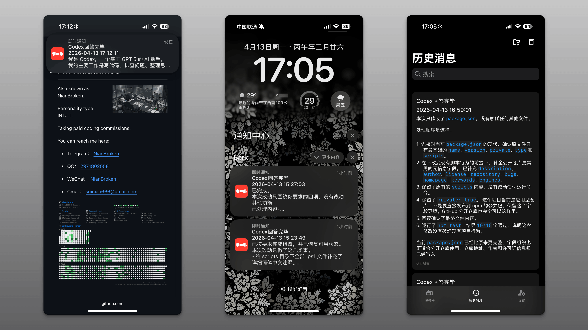

# CodexNotia



## 简介

CodexNotia 是一个后台通知服务，用于监听本机 `C:\Users\你的用户名\.codex\sessions` 目录中的 Codex 会话文件。

当 Codex CLI 或 Codex App 的某条消息回答完成后，CodexNotia 会调用 [Bark](https://bark.day.app/#/tutorial) 推送接口，将通知发送到手机。

如果某条消息在最终完成前出现异常、中断或超时，CodexNotia 会将错误信息推送到手机。

思考过程、工具调用、网页搜索、文件编辑、命令执行等中间过程均不会触发推送。用户向 Codex 发送的消息同样不会触发推送。

CodexNotia 在运行过程中不会弹出任何窗口，包括命令行窗口，全程无感运行。

在 IDE 或其他软件中通过 Codex 插件使用 Codex 的场景同样适用，不仅限于 Codex CLI 或 Codex App 本身。

## 使用场景

Codex 的回答时间通常较长，有时需要 30 分钟甚至更久。

在此期间，无需一直守在电脑前盯着 Codex 会话页面。

可以拿起手机去别处自由活动，等收到 Codex 回答完成的通知后，再回到电脑前继续工作。

## 测试环境

```
Windows 11 专业版 23H2 22631.4391
Codex CLI 0.118.0
Codex App 26.325.31654
Node 24.14.1
Npm 11.11.0
```

理论上可以向上兼容，即自动适配更新的版本。

## 先决条件

- 操作系统为 [Windows](https://www.microsoft.com/en-us/software-download/)
- 已安装 [Codex CLI](https://openai.com/codex/) 或 [Codex App](https://openai.com/codex/)
- [Node](https://nodejs.org/en/download) 版本不低于 18.0.0
- 手机已安装 [Bark](https://bark.day.app/#/tutorial) App

## 使用方法

1. 将项目放到一个准备长期保存的位置，例如 `D:\CodexNotia`。

2. 打开 Bark App，复制 `device_key`。

3. 打开 CodexNotia 的 `config\codexnotia.example.json`，将第 23 行 `deviceKey` 的值替换为你的 Bark Key。

4. 回到 CodexNotia 根目录。

5. 手动测试通知服务。如果手机收到内容为“通知测试”的通知，表示配置成功。

```
node .\src\main.mjs notify success --config .\config\codexnotia.json --text "通知测试"
```

6. 运行 `scripts\install.ps1` 脚本安装 CodexNotia。如果输出“已安装计划任务并启动后台服务”，表示安装成功。安装后默认开启开机自启动。

```
powershell -NoProfile -ExecutionPolicy Bypass -File .\scripts\install.ps1
```

7. 运行 `scripts\status.ps1` 脚本查看 CodexNotia 状态。如果以下四个值均为 `true`，表示运行正常。

```
powershell -NoProfile -ExecutionPolicy Bypass -File .\scripts\status.ps1
```

- `Installed`
- `WrapperProcessRunning`
- `ServiceProcessRunning`
- `HealthFresh`

8. 向 Codex CLI 或 Codex App 发送一条消息，等待回答完成。如果手机收到通知，表示一切就绪。

**此后，除非主动停止或卸载 CodexNotia，否则它会始终保持在后台运行。**

**无论是否重启电脑、是否重启 Codex，它都会持续推送 Codex 的消息。**

## 相关功能

以下所有命令均需在 CodexNotia 根目录下运行。

### 安装

```
powershell -NoProfile -ExecutionPolicy Bypass -File .\scripts\install.ps1
```

### 卸载

```
powershell -NoProfile -ExecutionPolicy Bypass -File .\scripts\uninstall.ps1
```

卸载操作会停止并删除计划任务，根据锁文件停止服务进程和包装进程，同时删除状态目录和日志目录。

卸载完成后，系统会恢复到从未安装过 CodexNotia 的状态。如需继续使用，需重新运行 `install.ps1`。

### 启动服务

```
powershell -NoProfile -ExecutionPolicy Bypass -File .\scripts\start.ps1
```

### 停止服务

```
powershell -NoProfile -ExecutionPolicy Bypass -File .\scripts\stop.ps1
```

### 开启开机自启动

```
powershell -NoProfile -ExecutionPolicy Bypass -File .\scripts\enable-autostart.ps1
```

### 关闭开机自启动

```
powershell -NoProfile -ExecutionPolicy Bypass -File .\scripts\disable-autostart.ps1
```

### 删除计划任务

```
powershell -NoProfile -ExecutionPolicy Bypass -File .\scripts\remove-scheduled-task.ps1
```

### 查看当前状态

```
powershell -NoProfile -ExecutionPolicy Bypass -File .\scripts\status.ps1
```

### 修改代码或配置后测试可用性

```
npm test
```

## 消息规则

当 AI 回答的完整消息不超过 4096 个字符时，完整内容会被推送到手机。

当 AI 回答的完整消息超过 4096 个字符时，会截取至最接近 4096 个字符且不超过该限制的句号位置之前的内容，句号本身不包含在内，并在末尾追加省略号后推送到手机。

如果文本中同时存在中文句号和英文句号，优先选取最接近 4096 个字符位置的句号进行截断。

当 AI 回答过程中出现错误时，错误信息会被推送到手机。错误信息的长度同样适用上述截断规则。

## 鲁棒性

当 CodexNotia 自身出现错误时，会尽可能捕获异常以避免程序崩溃，同时将错误记录到日志中，并尽可能将错误信息推送到手机。

当推送服务出现错误时，会自动重试。

当一段对话持续超过 10800000 毫秒（即 3 小时）仍未回答完成时，视为超时，CodexNotia 会向手机推送错误消息。

## 日志和状态目录

`%localappdata%\CodexNotia\`

## 常见问题

**Q1：CodexNotia 是否具备自定义配置功能？**

修改 `config\codexnotia.json` 即可自定义配置。

**Q2：`config\codexnotia.json` 中各配置项的作用是什么？**

参阅 `src\config.mjs` 文件中的注释。

**Q3：为什么有两个配置文件，它们有什么区别？**

`config\codexnotia.json` 为用户配置文件，`src\config.mjs` 为系统默认配置。

当某个配置项在 `config\codexnotia.json` 中存在值时，CodexNotia 使用该值；

当某个配置项在 `config\codexnotia.json` 中为空时，CodexNotia 使用 `src\config.mjs` 中的默认值。

建议只修改 `config\codexnotia.json` 文件。

**Q4：修改了代码或配置后为什么没有生效？**

需要重启服务以加载新的代码或配置。

```
powershell -NoProfile -ExecutionPolicy Bypass -File .\scripts\stop.ps1
powershell -NoProfile -ExecutionPolicy Bypass -File .\scripts\start.ps1
```

**Q5：修改了 CodexNotia 的路径后出现异常怎么办？**

需要重新安装以适配新路径。

```
powershell -NoProfile -ExecutionPolicy Bypass -File .\scripts\stop.ps1
powershell -NoProfile -ExecutionPolicy Bypass -File .\scripts\install.ps1
```

**Q6：修改了 `service.name` 后出现异常怎么办？**

1. 按下 Win+R 快捷键，输入 `taskschd.msc` 打开“任务计划程序”。
2. 找到名称为 `CodexNotia` 的任务并删除。如果此前已多次修改名称，应查找上一次修改后对应名称的任务。
3. 重新安装以使用新的 `service.name`。

```
powershell -NoProfile -ExecutionPolicy Bypass -File .\scripts\stop.ps1
powershell -NoProfile -ExecutionPolicy Bypass -File .\scripts\install.ps1
```

**Q7：CodexNotia 会泄露用户信息吗？**

CodexNotia 仅调用 [Bark](https://bark.day.app/#/tutorial) 推送接口，将通知发送到对应 DeviceKey 值的设备，除此之外不存在任何上传数据的行为。

一条推送从发送到接收的路径为：发送端 → 服务端 → 苹果 APNS 服务器 → 用户设备 → Bark App。

如果对安全性有顾虑，可以参考 Bark 的[推送加密](https://bark.day.app/#/encryption)教程编写相关代码，然后提交 Pull Request。也可以选择[自行部署 Bark 后端服务](https://bark.day.app/#/deploy)。

**Q8：后续是否会增加其他通知推送服务，例如邮箱、Telegram Bot、iMessage、飞书等？**

暂无相关计划。

## 许可证

`Copyright © 2026 NianBroken. All rights reserved.`

本项目采用 [Apache-2.0](https://www.apache.org/licenses/LICENSE-2.0 "Apache-2.0") 许可证。简而言之，你可以自由使用、修改和分享本项目的代码，但前提是在其衍生作品中必须保留原始许可证和版权信息，并且必须以相同的许可证发布所有修改过的代码。

## 恰饭

[Great-Firewall](https://nianbroken.github.io/Great-Firewall/) 好用的 VPN

[Ciii](https://ciii.klaio.top/) Codex 中转

[Aizex](https://aizex.klaio.top/) ChatGPT 镜像站

以上绝对都是性价比最高的。

## 其他

欢迎提交 `Issues` 和 `Pull requests`